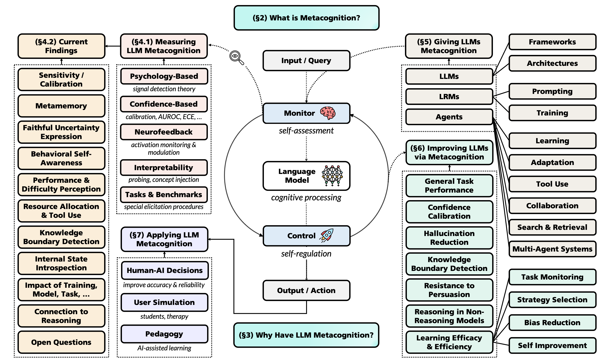

<h1 align="center"> 🧠 Metacognition in LLMs: <br>Foundations, Progress, and Opportunities </h1>

<div align="center">

<!-- [](https://arxiv.org/pdf/2607.11881)  -->
[](https://arxiv.org/abs/2607.11881) 

<!-- [](https://github.com/jeffhj/LM-reasoning) -->
[](https://opensource.org/licenses/MIT)
[](https://github.com/yale-nlp/LLM-Metacognition/stargazers)

</div>

<!-- This repository contains an organized collection of papers related to metacognition in large language xmodels (LLMs). These papers are organized according to our paper [Metacognition in LLMs: Foundations, Progress, and Opportunities](link). -->

<!-- **Metacognition** is a foundational component of intelligence that has become increasingly recognized as a cornerstone of capable, transparent AI systems in recent years. It is critical to effective learning, problem solving, decision-making, communication, and more. Yet while LLMs have made significant progress across diverse real-world tasks, it remains unclear when, how, and to what extent they can exhibit or be endowed with effective metacognitive abilities—and how such abilities can be adapted to advance the fundamental capabilities, reliability, and intelligence of AI systems.  -->

This repository provides an organized collection of papers related to metacognition in LLMs, reviewed in our paper [Metacognition in LLMs: Foundations, Progress, and Opportunities](https://arxiv.org/pdf/2607.11881). We comprehensively and systematically taxonomize the landscape of this emerging field, summarizing existing methods and benchmarks to measure and elicit LLMs' metacognitive abilities, techniques to develop, improve, and apply models' metacognitive skills, and findings and implications of ongoing research. We also discuss applications, open challenges, and promising directions for future work. We hope this can serve as a detailed, up-to-date reference and stimulate meaningful research and discussion.
<!-- 
## 🎉 Updates
- 2026/XX/XX Our paper is available on [arXiv]()!
- 2026/05/22 We created this reading list repository. -->

## 🌟 Citation

If you find this paper or repository useful for your research, please cite:

```bibtex
@misc{liu2026metacognition,
      title={Metacognition in LLMs: Foundations, Progress, and Opportunities}, 
      author={Gabrielle Kaili-May Liu and Areeb Gani and Jacqueline Lu and Jordan Thomas and Mark Steyvers and Arman Cohan},
      journal={arXiv preprint arXiv:2607.11881},
      year={2026},
      url={https://arxiv.org/abs/2607.11881}, 
}
```

## 📧 Contact
Feel free to open an issue or contact us if you have any feedback or want to include your work in this list!

Corresponding Author: Kaili Liu (kaili.liu@yale.edu)


## 📖 Table of Contents
- [🗺️ Overview](#overview)
- [🧠 0. Metacognition Background](#0-metacognition-background)
- [🔎 1. Measuring Metacognition in LLMs](#1-measuring-metacognition-in-llms)
    - [Psychologically-Grounded Methods](#psychologically-grounded-methods)
    - [Neurofeedback-Based Methods](#neurofeedback-based-methods)
    - [Confidence-Based Methods](#confidence-based-methods)
    - [Interpretability-Based Methods](#interpretability-based-methods)
    - [Task-Specific Methods](#task-specific-methods)
    - [Benchmarks](#benchmarks)
- [📊 2. Current Findings on Metacognition in LLMs](#2-current-findings-on-metacognition-in-llms)
- [🛠️ 3. Implementing Metacognition in LLMs](#3-implementing-metacognition-in-llms)
    - [Metacognition for LLMs](#metacognition-for-llms)
    - [Metacognition for Reasoning Models](#metacognition-for-reasoning-models)
    - [Metacognition for LLM Agents](#metacognition-for-llm-agents)
- [🚀 4. Metacognitive Methods to Improve Capabilities of LLMs](#4-metacognitive-methods-to-improve-capabilities-of-llms)
    - [General Capabilities](#general-capabilities)
    - [Confidence Calibration](#confidence-calibration)
    - [Hallucination Reduction](#hallucination-reduction)
    - [Knowledge Boundary Detection](#knowledge-boundary-detection)
    - [Resistance to Persuasion](#resistance-to-persuasion)
    - [Interpretability](#interpretability)
    - [Reasoning for Non-Reasoning Models](#reasoning-for-non-reasoning-models)
    - [Retrieval](#retrieval)
    - [Self-Improvement](#self-improvement)
    - [Other Abilities](#other-abilities)
- [🚢 5. Applications of LLM Metacognition](#5-applications-of-llm-metacognition)
    - [Human-AI Decision-Making](#human-ai-decision-making)
    - [User Simulation](#user-simulation)
    - [Pedagogy](#pedagogy)
- [🌱 6. Broader Directions](#6-broader-directions)
    - [AI Metacognition](#mcai)
    - [Creativity](#creativity)
    - [Self-Improvement ](#selfimprov)
    - [Meta-Metacognition & Theory of Mind](#mmc)
    - [Risks & Ethics](#risks)
- [📚 7. Other Resources](#7-other-resources)
<!-- - [Contact](#-contact) -->

<!-- 🛸 🔭 🗂️-->

<a name="overview"></a>

## 🗺️ Overview

<p align="center">
  
</p>

<p align="center">
<em><b>Taxonomy of current research on metacognition in LLMs, as organized in our <a href="https://arxiv.org/pdf/2607.11881" target="_blank">paper</a>.</b><br>Metacognition describes the capacity for a system to assess and regulate its own cognition. The metacognitive loop consists of two interacting processes: <i>monitoring</i> (e.g., forming judgments of uncertainty, task performance, and progress, among other internal states) and <i>control</i> (e.g., engaging in planning, strategy selection, or effort re-allocation based on monitoring).</em>
</p>

## 📄 Paper List

<a name="0-metacognition-background"></a>

### 🧠 0. Metacognition Background

> **Metacognition** is a foundational component of intelligence that is critical to effective learning, problem solving, decision-making, communication, and more. In recent years, it has become increasingly recognized as a cornerstone of capable, transparent AI systems.

#### _Fundamentals_
1. **Metacognition and Cognitive Monitoring: A New Area of Cognitive–Developmental Inquiry**, _Flavell_, American Psychologist 1979. \[[Paper](https://psycnet.apa.org/doi/10.1037/0003-066X.34.10.906)\]
194. **Feeling of Knowing in Memory and Problem Solving**, _Metcalfe_, Journal of Experimental Psychology: Learning, Memory, and Cognition 1986. \[[Paper](https://doi.org/10.1037/0278-7393.12.2.288)\]
200. **Metamemory: A Theoretical Framework and New Findings**, _Nelson_, Psychology of Learning and Motivation 1990. \[[Paper](https://doi.org/10.1016/S0079-7421(08)60053-5)\]
128. **Metacognition and Awareness**, _Kentridge_, Consciousness and Cognition 2000. \[[Paper](https://doi.org/10.1006/ccog.2000.0448)\]
192. **Metacognition and Learning**, _McCormick_, Handbook of Psychology 2003. \[[Paper](https://doi.org/10.1002/0471264385.wei0705)\]
271. **Metacognition and Learning: Conceptual and Methodological Considerations**, _Veenman et al._, Metacognition and Learning 2006. \[[Paper](https://doi.org/10.1007/s11409-006-6893-0)\]
135. **Metacognitive Aspects of Memory**, _Koriat and Helstrup_, Everyday Memory (Book Chapter) 2007. \[[Paper](https://psycnet.apa.org/record/2007-01929-011)\]
65. **Metacognition**, _Dunlosky and Metcalfe_, Sage Publications (Book) 2008. \[[Paper](https://collegepublishing.sagepub.com/products/metacognition-1-229322)\]
83. **Metacognition: Computation, Biology and Function**, _Fleming et al._, Philosophical Transactions of the Royal Society B 2012. \[[Paper](https://doi.org/10.1098/rstb.2012.0021)\]
64. **Handbook of Metamemory and Memory**, _Dunlosky and Bjork_, Psychology Press (Book) 2013. \[[Paper](https://psycnet.apa.org/record/2008-07511-000)\]
134. **Metacognition: Decision Making Processes in Self-Monitoring and Self-Regulation**, _Koriat_, Wiley Blackwell Handbook of Judgment and Decision Making 2015. \[[Paper](https://doi.org/10.1002/9781118468333.ch12)\]
197. **Metacognitive Theories Revisited**, _Moshman_, Educational Psychology Review 2018. \[[Paper](https://doi.org/10.1007/s10648-017-9413-7)\]
79. **Metacognition and Confidence: A Review and Synthesis**, _Fleming_, Annual Review of Psychology 2024. \[[Paper](https://doi.org/10.1146/annurev-psych-022423-032425)\]

#### _Mechanisms_
14. **The Neural Basis of Metacognitive Ability**, _Fleming and Dolan_, Philosophical Transactions of the Royal Society B 2012. \[[Paper](https://doi.org/10.1098/rstb.2011.0417)\]
76. **Domain-Specific and Domain-General Processes Underlying Metacognitive Judgments**, _Fitzgerald et al._, Consciousness and Cognition 2017. \[[Paper](https://doi.org/10.1016/j.concog.2017.01.011)\]
196. **Domain-General and Domain-Specific Patterns of Activity Supporting Metacognition in Human Prefrontal Cortex**, _Morales et al._, Journal of Neuroscience 2018. \[[Paper](https://doi.org/10.1523/JNEUROSCI.2360-17.2018)\]
190. **Towards a Common Conceptual Space for Metacognition in Perception and Memory**, _Mazancieux et al._, Nature Reviews Psychology 2023. \[[Paper](https://doi.org/10.1038/s44159-023-00245-1)\]

#### _Measuring Metacognition_
18. **Confidence and Accuracy of Near-Threshold Discrimination Responses**, _Kunimoto et al._, Consciousness and Cognition 2001. \[[Paper](https://doi.org/10.1006/ccog.2000.0494)\]
230. **A Conceptual Analysis of Five Measures of Metacognitive Monitoring**, _Schraw_, Metacognition and Learning 2009. \[[Paper](https://doi.org/10.1007/s11409-008-9031-3)\]
4. **Literature Review on Metacognition and Its Measurement**, _Akturk and Sahin_, Procedia-Social and Behavioral Sciences 2011. \[[Paper](https://doi.org/10.1016/j.sbspro.2011.04.364)\]
185. **A Signal Detection Theoretic Approach for Estimating Metacognitive Sensitivity from Confidence Ratings**, _Maniscalco and Lau_, Consciousness and Cognition 2012. \[[Paper](https://doi.org/10.1016/j.concog.2011.09.021)\]
13. **Measures of Metacognition on Signal-Detection Theoretic Models**, _Barrett et al._, Psychological Methods 2013. \[[Paper](https://doi.org/10.1037/a0033268)\]
82. **How to Measure Metacognition**, _Fleming and Lau_, Frontiers in Human Neuroscience 2014. \[[Paper](https://doi.org/10.3389/fnhum.2014.00443)\]
319. **Metacognitive Information Theory**, _Dayan_, Open Mind 2023. \[[Paper](https://doi.org/10.1162/opmi_a_00091)\]
319. **Common Computations for Metacognition and Meta-Metacognition**, _Zheng et al._, Neuroscience of Consciousness 2023. \[[Paper](https://doi.org/10.1093/nc/niad023)\]
319. **Information-Theoretic Measures of Metacognition: Bounds and Relation to Group Performance**, _Meyen et al._, Open Mind 2025. \[[Paper](https://doi.org/10.1162/OPMI.a.40)\]

#### _Connections to Consciousness_
27. **Metacognition and Consciousness**, _Newton_, Pragmatics & Cognition 1995. \[[Paper](https://doi.org/10.1075/pc.3.2.08new)\]
136. **Conscious and Unconscious Metacognition: A Rejoinder**, _Koriat and Levy-Sadot_, Consciousness and Cognition 2000. \[[Paper](https://doi.org/10.1006/ccog.2000.0436)\]
223. **Consciousness and Metacognition**, _Rosenthal_, Metarepresentation (Book Chapter) 2000. \[[Paper](https://doi.org/10.1093/oso/9780195141146.003.0010)\]
32. **Metacognition in Strategy Selection: Giving Consciousness Too Much Credit**, _Cary and Reder_, Metacognition: Process, Function and Use (Book Chapter) 2002. \[[Paper](https://doi.org/10.1007/978-1-4615-1099-4_5)\]
286. **Consciousness, Metacognition, and the Unconscious**, _Winkielman and Schooler_, The Sage Handbook of Social Cognition 2012. \[[Paper](https://doi.org/10.4135/9781446247631.n4)\]

#### _Confidence, Decisions, & Other Findings_
32. **A Revised Methodology for Research on Metamemory: Pre-Judgment Recall and Monitoring (PRAM)**, _Nelson et al._, Psychological Methods 2004. \[[Paper](https://doi.org/10.1037/1082-989X.9.1.53)\]
7. **Logic, Self-Awareness and Self-Improvement: The Metacognitive Loop and the Problem of Brittleness**, _Anderson and Perlis_, Journal of Logic and Computation 2005. \[[Paper](https://doi.org/10.1093/logcom/exh034)\]
231. **Competence and Control Beliefs: Distinguishing the Means and Ends**, _Schunk and Zimmerman_, Handbook of Educational Psychology 2006. \[[Paper](https://www.routledgehandbooks.com/doi/10.4324/9780203874790.ch16)\]
66. **The Dunning–Kruger Effect: On Being Ignorant of One's Own Ignorance**, _Dunning_, Advances in Experimental Social Psychology 2011. \[[Paper](https://doi.org/10.1016/B978-0-12-385522-0.00005-6)\]
122. **Thinking, Fast and Slow**, _Kahneman_, Macmillan (Book) 2011. \[[Paper](https://us.macmillan.com/books/9780374533557/thinkingfastandslow)\]
262. **Higher Order Thoughts in Action: Consciousness as an Unconscious Re-Description Process**, _Timmermans et al._, Philosophical Transactions of the Royal Society B 2012. \[[Paper](https://doi.org/10.1098/rstb.2011.0421)\]
1. **Meta-Reasoning: Monitoring and Control of Thinking and Reasoning**, _Ackerman and Thompson_, Trends in Cognitive Sciences 2017. \[[Paper](https://doi.org/10.1016/j.tics.2017.05.004)\]
240. **But I Was So Sure! Metacognitive Judgments Are Less Accurate Given Prospectively Than Retrospectively**, _Siedlecka et al._, Frontiers in Psychology 2016. \[[Paper](https://doi.org/10.3389/fpsyg.2016.00218)\]
80. **Self-Evaluation of Decision-Making: A General Bayesian Framework for Metacognitive Computation**, _Fleming and Daw_, Psychological Review 2017. \[[Paper](https://doi.org/10.1037/rev0000045)\]
244. **Closed-Loop Brain Training: The Science of Neurofeedback**, _Sitaram et al._, Nature Reviews Neuroscience 2017. \[[Paper](https://doi.org/10.1038/nrn.2016.164)\]
50. **How Multiple Levels of Metacognitive Awareness Operate in Collaborative Problem Solving**, _Cini et al._, Metacognition and Learning 2023. \[[Paper](https://doi.org/10.1007/s11409-023-09358-7)\]
75. **Bits of Confidence: Metacognition as Uncertainty Reduction**, _Fitousi_, Psychonomic Bulletin & Review 2025. \[[Paper](https://doi.org/10.3758/s13423-025-02752-z)\]

#### _Education & Learning_
44. **A Metacognitive View of Individual Differences in Self-Regulated Learning**, _Winne_, Learning and Individual Differences 1996. \[[Paper](https://doi.org/10.1016/S1041-6080(96)90022-9)\]
191. **Motivational Skills Training: Combining Metacognitive, Cognitive, and Affective Learning Strategies**, _McCombs_, Learning and Study Strategies (Book Chapter) 1988. \[[Paper](https://doi.org/10.1016/B978-0-12-742460-6.50015-3)\]
229. **Promoting General Metacognitive Awareness**, _Schraw_, Instructional Science 1998. \[[Paper](https://dohttps://doi.org/10.1023/A:1003044231033)\]
139. **Unskilled and Unaware of It: How Difficulties in Recognizing One's Own Incompetence Lead to Inflated Self-Assessments**, _Kruger and Dunning_, Journal of Personality and Social Psychology 1999. \[[Paper](https://doi.org/10.1037/0022-3514.77.6.1121)\]
138. **Enhancing Mathematical Reasoning in the Classroom: The Effects of Cooperative Learning and Metacognitive Training**, _Kramarski and Mevarech_, American Educational Research Journal 2003. \[[Paper](https://doi.org/10.3102/00028312040001281)\]
285. **A Theoretical Framework and Approach for Fostering Metacognitive Development**, _White and Frederiksen_, Educational Psychologist 2005. \[[Paper](https://doi.org/10.1207/s15326985ep4004_3)\]
115. **Metacognitive Knowledge Monitoring and Self-Regulated Learning**, _Isaacson and Fujita_, Journal of the Scholarship of Teaching and Learning 2006. \[[Paper](https://scholarworks.iu.edu/journals/index.php/josotl/article/view/1624)\]
307. **Metacognitive Awareness and Academic Achievement in College Students**, _Young and Fry_, Journal of the Scholarship of Teaching and Learning 2008. \[[Paper](https://scholarworks.iu.edu/journals/index.php/josotl/article/view/1696)\]
51. **The Importance of Self-Regulation for College Student Learning**, _Cohen_, APA PsycNet 2012. \[[Paper](https://psycnet.apa.org/record/2012-33316-018)\]
85. **The Role of Metacognition in Human Social Interactions**, _Frith_, Philosophical Transactions of the Royal Society B 2012. \[[Paper](https://doi.org/10.1098/rstb.2012.0123)\]
36. **Development and Evaluation of Metacognition in Early Childhood Education**, _Chatzipanteli et al._, Early Child Development and Care 2014. \[[Paper](https://doi.org/10.1080/03004430.2013.861456)\]
260. **Can the Use of Cognitive and Metacognitive Self-Regulated Learning Strategies Be Predicted by Learners' Levels of Prior Knowledge in Hypermedia-Learning Environments?**, _Taub et al._, Computers in Human Behavior 2014. \[[Paper](https://doi.org/10.1016/j.chb.2014.07.018)\]
41. **Strategic Resource Use for Learning: A Self-Administered Intervention That Guides Self-Reflection on Effective Resource Use Enhances Academic Performance**, _Chen et al._, Psychological Science 2017. \[[Paper](https://doi.org/10.1177/0956797617696456)\]
1. **Domain-general enhancements of metacognitive ability through adaptive training**, _Carpente et al._, Journal of Experimental Psychology: General 2019. \[[Paper](https://doi.org/10.1037/xge0000505)\]
84. **Metacognition: Ideas and Insights from Neuro- and Educational Sciences**, _Fleur et al._, npj Science of Learning 2021. \[[Paper](https://doi.org/10.1038/s41539-021-00089-5)\]
215. **Metacognitive Feelings as a Source of Information for the Creative Process: A Conceptual Exploration**, _Puente-Diaz_, Journal of Intelligence 2023. \[[Paper](https://doi.org/10.3390/jintelligence11030049)\]
288. **Experiencing Hallucinations in Daily Life: The Role of Metacognition**, _Wright et al._, Schizophrenia Research 2024. \[[Paper](https://doi.org/10.1016/j.schres.2022.12.023)\]

#### _Connections to AI_
61. **Modeling Metacognition for Learning in Artificial Systems**, _Josyula et al._, NaBIC 2009. \[[Paper](https://doi.org/10.1109/NABIC.2009.5393706)\]
127. **From Internal Models Toward Metacognitive AI**, _Kawato and Cortese_, Biological Cybernetics 2021. \[[Paper](https://doi.org/10.1007/s00422-021-00904-7)\]
16. **Fast, Slow, and Metacognitive Thinking in AI**, _Ganapini et al._, npj Artificial Intelligence 2025. \[[Paper](https://doi.org/10.1038/s44387-025-00027-5)\]

<a name="1-measuring-metacognition-in-llms"></a>

### 🔎 1. Measuring Metacognition in LLMs 

<!-- while LLMs have made significant progress across diverse real-world tasks, it remains unclear when, how, and to what extent they can exhibit or be endowed with effective metacognitive abilities—and how such abilities can be adapted to advance the fundamental capabilities, reliability, and intelligence of AI systems.  -->

<a name="psychologically-grounded-methods"></a>

#### _Psychologically-Grounded Methods_
64. **Measuring the Metacognition of AI**, _Servajean and Servajean_, arXiv 2026. \[[Paper](https://arxiv.org/pdf/2603.29693)\]
267. **Metacognitive Sensitivity for Test-Time Dynamic Model Selection**, _Trinh et al._, CogInterp Workshop 2026. \[[Paper](https://openreview.net/pdf?id=wROFSZZXu9)\]
112. **Judgments of Learning Distinguish Humans from Large Language Models in Predicting Memory**, _Huff and Ulakci_, Scientific Reports 2025. \[[Paper](https://doi.org/10.1038/s41598-025-22290-x)\]
234. **Do LLMs Dream of Electric Emotions? Towards Quantifying Metacognition and Generalizing the Teacher-Student Model Using Ensembles of LLMs**, _Sethi et al._, CIKM 2025. \[[Paper](https://doi.org/10.1145/3746252.3760839)\]
277. **Decoupling Metacognition from Cognition: A Framework for Quantifying Metacognitive Ability in LLMs**, _Wang et al._, AAAI 2025. \[[Paper](https://ojs.aaai.org/index.php/AAAI/article/view/34723)\]
111. **Metacognitive Monitoring: A Human Ability Beyond Generative Artificial Intelligence**, _Huff and Ulakci_, arXiv 2024. \[[Paper](https://arxiv.org/pdf/2410.13392)\]
<!-- 62. **Do LLMs Know What They Know? Measuring Metacognitive Efficiency with Signal Detection Theory**, _Cacioli_, arXiv 2026. \[[Paper](https://arxiv.org/pdf/2603.25112)\] -->

<a name="neurofeedback-based-methods"></a>

#### _Neurofeedback-Based Methods_
70. **Language Models Are Capable of Metacognitive Monitoring and Control of Their Internal Activations**, _Li et al._, NeurIPS 2026. \[[Paper](https://proceedings.neurips.cc/paper_files/paper/2025/file/56a225639da77e8f7c0409f6d5ba996b-Paper-Conference.pdf)\]
296. **Indications of Belief-Guided Agency and Meta-Cognitive Monitoring in Large Language Models**, _Yalon et al._, arXiv 2026. \[[Paper](https://arxiv.org/pdf/2602.02467)\]

<a name="confidence-based-methods"></a>

#### _Confidence-Based Methods_
72. **Auditing Meta-Cognitive Hallucinations in Reasoning Large Language Models**, _Lu et al._, NeurIPS 2026. \[[Paper](https://proceedings.neurips.cc/paper_files/paper/2025/file/ee0e336e2423430ef86071300299e074-Paper-Conference.pdf)\]
72. **Large Language Models Have Intrinsic Meta-Cognition, but Need a Good Lens**, _Ma et al._, EMNLP 2025. \[[Paper](https://aclanthology.org/2025.emnlp-main.171/)\]

<a name="interpretability-based-methods"></a>

#### _Interpretability-Based Methods_
74. **Towards Understanding Metacognition in Large Reasoning Models**, _Li et al._, OpenReview 2026. \[[Paper](https://openreview.net/pdf?id=JGG9EdHyZc)\]
169. **Emergent Introspective Awareness in Large Language Models**, _Lindsey_, arXiv 2026. \[[Paper](https://arxiv.org/pdf/2601.01828)\]
158. **Adaptive Tool Use in Large Language Models with Meta-Cognition Trigger**, _Li et al._, ACL 2025. \[[Paper](https://aclanthology.org/2025.acl-long.655/)\]

<a name="task-specific-methods"></a>

#### _Task-Specific Methods_
77. **Evidence for Limited Metacognition in LLMs**, _Ackerman_, arXiv 2025. \[[Paper](https://arxiv.org/pdf/2509.21545)\]
15. **Large Linguistic Models: Investigating LLMs' Metalinguistic Abilities**, _Begus et al._, IEEE Transactions on Artificial Intelligence 2025. \[[Paper](https://ieeexplore.ieee.org/stamp/stamp.jsp?arnumber=11022724)\]
53. **Does It Make Sense to Speak of Introspection in Large Language Models?**, _Comsa and Shanahan_, arXiv 2025. \[[Paper](https://arxiv.org/pdf/2506.05068)\]
213. **When Two LLMs Debate, Both Think They'll Win**, _Prasad and Nguyen_, arXiv 2025. \[[Paper](https://arxiv.org/pdf/2505.19184)\]
58. **Metacognitive Capabilities of LLMs: An Exploration in Mathematical Problem Solving**, _Didolkar et al._, NeurIPS 2024. \[[Paper](https://proceedings.neurips.cc/paper_files/paper/2024/file/2318d75a06437eaa257737a5cf3ab83c-Paper-Conference.pdf)\]
269. **Beyond Traditional AI IQ Metrics: Metacognition and Benchmarking for LLMs, AGI, and ASI**, _Uzwyshyn_, ResearchGate 2024. \[[Paper](https://doi.org/10.13140/RG.2.2.36817.34400)\]

<a name="benchmarks"></a>

#### _Benchmarks_
83. **The metacognitive monitoring battery: A cross-domain benchmark for LLM self-monitoring**, _Cacioli et al._, arXiv 2026. \[[Paper](https://arxiv.org/pdf/2604.15702)\]
118. **Towards Meta-Cognitive Knowledge Editing for Multimodal LLMs**, _Fan et al._, The Web Conference 2026. \[[Paper](https://doi.org/10.1145/3774904.3792531)\]
48. **Me, Myself, and π : Evaluating and Explaining LLM Introspection**, _Naphade et al._, arXiv 2026. \[[Paper](https://arxiv.org/pdf/2603.20276)\]
95. **Large Language Models Lack Essential Metacognition for Reliable Medical Reasoning**, _Griot et al._, Nature Communications 2025. \[[Paper](https://doi.org/10.1038/s41467-024-55628-6)\]
130. **ObjexMT: Objective Extraction and Metacognitive Calibration for LLM-as-a-Judge Under Multi-Turn Jailbreaks**, _Kim et al._, arXiv 2025. \[[Paper](https://arxiv.org/pdf/2508.16889)\]
210. **Awareness in LLMs Improves Through Collaboration**, _Passaro et al._, EurIPS Workshop on Metacognition in Generative AI 2025. \[[Paper](https://openreview.net/forum?id=SLdSqX3Rno)\]
310. **From Remembering to Metacognition: Do Existing Benchmarks Accurately Evaluate LLMs?**, _Zhang et al._, EMNLP Findings 2025. \[[Paper](https://aclanthology.org/2025.findings-emnlp.724/)\]

<a name="2-current-findings-on-metacognition-in-llms"></a>

### 📊 2. Current Findings on Metacognition in LLMs 
90. **Language Models Are Capable of Metacognitive Monitoring and Control of Their Internal Activations**, _Li et al._, NeurIPS 2026. \[[Paper](https://proceedings.neurips.cc/paper_files/paper/2025/file/56a225639da77e8f7c0409f6d5ba996b-Paper-Conference.pdf)\]
169. **Emergent Introspective Awareness in Large Language Models**, _Lindsey_, arXiv 2026. \[[Paper](https://arxiv.org/pdf/2601.01828)\]
25. **Emergent Mechanisms of Self-Awareness in LLMs**, _Bozoukov et al._, XAI4Science Workshop (NeurIPS) 2025. \[[Paper](https://openreview.net/pdf?id=6GGhnrQ2EV)\]
100. **Looking Inward: Language Models Can Learn About Themselves by Introspection**, _Binder et al._, ICLR 2025. \[[Paper](https://openreview.net/forum?id=eb5pkwIB5i)\]
214. **Do Large Language Models Know How Much They Know?**, _Prato et al._, EMNLP 2024. \[[Paper](https://aclanthology.org/2024.emnlp-main.348/)\]
98. **Feeling the Strength but Not the Source: Partial Introspection in LLMs**, _Hahami et al._, arXiv 2025. \[[Paper](https://arxiv.org/pdf/2512.12411)\]
112. **Judgments of Learning Distinguish Humans from Large Language Models in Predicting Memory**, _Huff and Ulakci_, Scientific Reports 2025. \[[Paper](https://doi.org/10.1038/s41598-025-22290-x)\]
165. **Meta-Cognitive Analysis: Evaluating Declarative and Procedural Knowledge in Datasets and Large Language Models**, _Li et al._, LREC-COLING 2024. \[[Paper](https://aclanthology.org/2024.lrec-main.980/)\]
1. **Meta-Memory for Large Language Models**, _Liang et al.,_ IEEE Transactions on Audio, Speech and Language Processing 2026. \[[Paper](https://ieeexplore.ieee.org/stamp/stamp.jsp?tp=&arnumber=11515167)\]
277. **Decoupling Metacognition from Cognition: A Framework for Quantifying Metacognitive Ability in LLMs**, _Wang et al._, AAAI 2025. \[[Paper](https://ojs.aaai.org/index.php/AAAI/article/view/34723)\]
171. **MetaFaith: Faithful Natural Language Uncertainty Expression in LLMs**, _Liu et al._, EMNLP 2025. \[[Paper](https://aclanthology.org/2025.emnlp-main.1505/)\]
1. **Can LLMs Use Linguistic Uncertainty Markers to Reliably Reflect Intrinsic Confidence?** _Liu and Cohan_, arXiv 2026. \[[Paper](https://arxiv.org/pdf/2605.28778)\]
1. **Quantifying Faithful Confidence Expression in Large Reasoning Models**, _Liu et al._, arXiv 2026. \[[Paper](https://arxiv.org/pdf/2606.03969)\]
1. **Reinforcement Learning with Metacognitive Feedback Elicits Faithful Uncertainty Expression in LLMs**, _Liu et al._, arXiv 2026. \[[Paper](https://arxiv.org/pdf/2606.32032)\]
249. **Metacognition and Uncertainty Communication in Humans and Large Language Models**, _Steyvers and Peters_, Current Directions in Psychological Science 2025. \[[Paper](https://doi.org/10.1177/09637214251391158)\]
251. **What Large Language Models Know and What People Think They Know**, _Steyvers et al._, Nature Machine Intelligence 2025. \[[Paper](https://doi.org/10.1038/s42256-024-00976-7)\]
111. **Metacognitive Monitoring: A Human Ability Beyond Generative Artificial Intelligence**, _Huff and Ulakci_, arXiv 2024. \[[Paper](https://arxiv.org/pdf/2410.13392)\]
95. **Large Language Models Lack Essential Metacognition for Reliable Medical Reasoning**, _Griot et al._, Nature Communications 2025. \[[Paper](https://doi.org/10.1038/s41467-024-55628-6)\]
34. **Quantifying Uncert-AI-nty: Testing the Accuracy of LLMs' Confidence Judgments**, _Cash et al._, Memory & Cognition 2026. \[[Paper](https://doi.org/10.3758/s13421-025-01755-4)\]
113. **Can LLMs Estimate Cognitive Complexity of Reading Comprehension Items?**, _Hwang et al._, arXiv 2025. \[[Paper](https://arxiv.org/pdf/2510.25064)\]
129. **When Small Models Are Right for Wrong Reasons: Process Verification for Trustworthy Agents**, _Advani_, arXiv 2026. \[[Paper](https://arxiv.org/pdf/2601.00513)\]
12. **Do Large Language Models Know What They Are Capable Of?**, _Barkan et al._, arXiv 2025. \[[Paper](https://arxiv.org/pdf/2512.24661)\]
17. **Tell Me About Yourself: LLMs Are Aware of Their Learned Behaviors**, _Betley et al._, arXiv 2025. \[[Paper](https://arxiv.org/pdf/2501.11120)\]
114. **Do AI Know What They Know? Exploring Metacognition in LLMs**, _Iqbal_, Intelligent Data Analysis 2023. \[[Paper](https://doi.org/10.1177/1088467X261436903)\]
124. **Line of Duty: Evaluating LLM Self-Knowledge via Consistency in Feasibility Boundaries**, _Kale and Nadadur_, TrustNLP Workshop (ACL) 2025. \[[Paper](https://aclanthology.org/2025.trustnlp-main.10/)\]
283. **From Human to Model Overconfidence: Evaluating Confidence Dynamics in Large Language Models**, _Wen et al._, NeurIPS Workshop on Behavioral Machine Learning 2024. \[[Paper](https://openreview.net/pdf?id=y9UdO5cmHs)\]
48. **Causal Evidence that Language Models use Confidence to Drive Behavior**, _Kumaran et al._, arXiv 2026. \[[Paper](https://arxiv.org/pdf/2603.22161)\]
1. **Cognitive Foundations for Reasoning and Their Manifestation in LLMs**, _Karapugta et al._, HCAIR Workshop (ICLR) 2026. \[[Paper](https://openreview.net/forum?id=rRSiiKAxCx)\]
1. **Beyond Confidence: Rethinking Self-Assessments for Performance Prediction in LLMs**, _Bhattacharyya et al._, arXiv 2026. \[[Paper](https://arxiv.org/pdf/2605.07806)\]
48. **MIRROR: A Hierarchical Benchmark for Metacognitive Calibration in Large Language Models**, _Wang et al._, arXiv 2026. \[[Paper](https://arxiv.org/pdf/2604.19809)\]
48. **LLMs Know When They Know, but Do Not Act on It: A Metacognitive Harness for Test-time Scaling**, _Cao et al._, arXiv 2026. \[[Paper](https://arxiv.org/pdf/2605.14186)\]
106. **Vulnerability of LLMs' Belief Systems? LLMs Belief Resistance Check Through Strategic Persuasive Conversation Interventions**, _Huang et al._, arXiv 2026. \[[Paper](https://arxiv.org/pdf/2601.13590)\]
27. **LLMs as Signal Detectors: Sensitivity, Bias, and the Temperature-Criterion Analogy**, _Cacioli_, arXiv 2026. \[[Paper](https://arxiv.org/pdf/2603.14893)\]
57. **Rescaling Confidence: What Scale Design Reveals About LLM Metacognition**, _Dai_, arXiv 2026. \[[Paper](https://arxiv.org/pdf/2603.09309)\]
47. **Mind the Confidence Gap: Overconfidence, Calibration, and Distractor Effects in Large Language Models**, _Chhikara_, arXiv 2025. \[[Paper](https://arxiv.org/pdf/2502.11028)\]
126. **Addressing Uncertainty in LLMs to Enhance Reliability in Generative AI**, _Kaur et al._, NeurIPS Safe Generative AI Workshop 2024. \[[Paper](https://openreview.net/pdf?id=Z3DS4Pcxct)\]
33. **Worth the Weight: Modern LLMs Demonstrate Accurate Metacognitive Knowledge of Decision Weights in Multi-Attribute Choice**, _Cash and Oppenheimer_, PsyArXiv 2025. \[[Paper](https://osf.io/r73ez)\]
255. **What Do LLM Agents Do When Left Alone? Evidence of Spontaneous Meta-Cognitive Patterns**, _Szeider_, arXiv 2025. \[[Paper](https://arxiv.org/pdf/2509.21224)\]
211. **Generative AI as a Metacognitive Agent: A Comparative Mixed-Method Study with Human Participants on ICF-Mimicking Exam Performance**, _Pavlovic et al._, arXiv 2024. \[[Paper](https://arxiv.org/pdf/2405.05285)\]
28. **Introspective Machines: Are LLMs Better at Self-Reflection Than Humans?**, _Cappelen and Dever_, Philosophical Perspectives 2024. \[[Paper](https://doi.org/10.1111/phpe.12201)\]
246. **Privileged Self-Access Matters for Introspection in AI**, _Song et al._, arXiv 2025. \[[Paper](https://arxiv.org/pdf/2508.14802)\]
208. **System Prompt Learning in Large Language Models: Cross-Disciplinary Parallels with Human Cognition**, _Pajo_, ResearchGate 2025. \[[Paper](https://doi.org/10.13140/RG.2.2.33480.23049)\]
245. **Language Models Fail to Introspect About Their Knowledge of Language**, _Song et al._, arXiv 2025. \[[Paper](https://arxiv.org/pdf/2503.07513)\]
213. **When Two LLMs Debate, Both Think They'll Win**, _Prasad and Nguyen_, arXiv 2025. \[[Paper](https://arxiv.org/pdf/2505.19184)\]
228. **Metacognitive Myopia in Large Language Models**, _Scholten et al._, arXiv 2024. \[[Paper](https://arxiv.org/pdf/2408.05568)\]
61. **Towards Understanding the Cognitive Habits of Large Reasoning Models**, _Dong et al._, arXiv 2025. \[[Paper](https://arxiv.org/pdf/2506.21571)\]
62. **From Latent Signals to Reflection Behavior: Tracing Meta-Cognitive Activation Trajectory in R1-Style LLMs**, _Du et al._, arXiv 2026. \[[Paper](https://arxiv.org/pdf/2602.01999)\]
67. **Overclocking LLM Reasoning: Monitoring and Controlling Thinking Path Lengths in LLMs**, _Eisenstadt et al._, arXiv 2025. \[[Paper](https://arxiv.org/pdf/2506.07240)\]
125. **Cognitive Foundations for Reasoning and Their Manifestation in LLMs**, _Kargupta et al._, arXiv 2025. \[[Paper](https://arxiv.org/pdf/2511.16660)\]
131. **Reasoning Models Generate Societies of Thought**, _Kim et al._, arXiv 2026. \[[Paper](https://arxiv.org/pdf/2601.10825)\]
177. **Understanding R1-Zero-Like Training: A Critical Perspective**, _Liu et al._, arXiv 2025. \[[Paper](https://arxiv.org/pdf/2503.20783)\]
179. **Auditing Meta-Cognitive Hallucinations in Reasoning Large Language Models**, _Lu et al._, NeurIPS 2026. \[[Paper](https://proceedings.neurips.cc/paper_files/paper/2025/file/ee0e336e2423430ef86071300299e074-Paper-Conference.pdf)\]
187. **DeepSeek-R1 Thoughtology: Let's Think About LLM Reasoning**, _Marjanovic et al._, arXiv 2025. \[[Paper](https://arxiv.org/pdf/2504.07128)\]
235. **A Trade-Off Between Reasoning Ability and Metacognitive Sensitivity in Large Language Models**, _Sha et al._, PsyArXiv 2026. \[[Paper](https://doi.org/10.31234/osf.io/8jq4f_v1)\]

<a name="3-implementing-metacognition-in-llms"></a>

### 🛠️ 3. Implementing Metacognition in LLMs

<a name="metacognition-for-llms"></a>

#### _Metacognition for LLMs_

144. **Towards Meta-Cognitive Knowledge Editing for Multimodal LLMs**, _Fan et al._, The Web Conference 2026. \[[Paper](https://doi.org/10.1145/3774904.3792531)\]
209. **Fine-Tuning Language Models to Know What They Know**, _Park et al._, arXiv 2026. \[[Paper](https://arxiv.org/pdf/2602.02605)\]
162. **State Stream Transformer (SST): Emergent Metacognitive Behaviours Through Latent State Persistence**, _Aviss_, arXiv 2025. \[[Paper](https://arxiv.org/pdf/2501.18356)\]
37. **Pangu Embedded: An Efficient Dual-System LLM Reasoner with Metacognition**, _Chen et al._, arXiv 2025. \[[Paper](https://arxiv.org/pdf/2505.22375)\]
55. **Toward Autonomy: Metacognitive Learning for Enhanced AI Performance**, _Conway-Smith and West_, AAAI Symposium Series 2024. \[[Paper](https://doi.org/10.1609/aaaiss.v3i1.31270)\]
60. **Meta-R1: Empowering Large Reasoning Models with Metacognition**, _Dong et al._, arXiv 2025. \[[Paper](https://arxiv.org/pdf/2508.17291)\]
108. **Towards Interpretable and Consistent Multi-Step Mathematical Reasoning in Large Language Models**, _Huang et al._, AIIM 2025. \[[Paper](https://doi.org/10.1109/AIIM67611.2025.11232978)\]
116. **Thinking About Thinking: SAGE-nano's Inverse Reasoning for Self-Aware Language Models**, _Jha et al._, arXiv 2025. \[[Paper](https://arxiv.org/pdf/2507.00092)\]
162. **Adapting Like Humans: A Metacognitive Agent with Test-Time Reasoning**, _Li et al._, arXiv 2025. \[[Paper](https://arxiv.org/pdf/2511.23262)\]
205. **Before You \<think\>, Monitor: Implementing Flavell's Metacognitive Framework in LLMs**, _Oh_, arXiv 2025. \[[Paper](https://arxiv.org/pdf/2510.16374)\]
206. **Monitor-Generate-Verify (MGV): Formalising Metacognitive Theory for Language Model Reasoning**, _Oh and Gobet_, arXiv 2025. \[[Paper](https://arxiv.org/pdf/2511.04341)\]
142. **Position: LLMs Need a Bayesian Meta-Reasoning Framework for More Robust and Generalizable Reasoning**, _Yan et al._, ICML 2025. \[[Paper](https://openreview.net/forum?id=RrvhbxO2hd)\]
313. **MIRA: An LLM-Driven Dual-Loop Architecture for Metacognitive Reward Design**, _Zhang et al._, Systems 2025. \[[Paper](https://doi.org/10.3390/systems13121124)\]
228. **Metacognitive Myopia in Large Language Models**, _Scholten et al._, arXiv 2024. \[[Paper](https://arxiv.org/pdf/2408.05568)\]

<a name="metacognition-for-reasoning-models"></a>

#### _Metacognition for Reasoning Models_

158. **PRISM-MCTS: Learning from Reasoning Trajectories with Metacognitive Reflection**, _Cheng et al._, arXiv 2026. \[[Paper](https://arxiv.org/pdf/2604.05424)\]
150. **Finding RELIEF: Shaping Reasoning Behavior Without Reasoning Supervision via Belief Engineering**, _Leong et al._, arXiv 2026. \[[Paper](https://arxiv.org/pdf/2601.13752)\]
48. **Enhancing LLM Metacognition via Cognitive Pairwise Training**, _Li et al._, arXiv 2026. \[[Paper](https://arxiv.org/pdf/2606.00869)\]
154. **Towards Understanding Metacognition in Large Reasoning Models**, _Li et al._, OpenReview 2026. \[[Paper](https://openreview.net/pdf?id=JGG9EdHyZc)\]
278. **Teaching Large Reasoning Models Effective Reflection**, _Wang et al._, arXiv 2026. \[[Paper](https://arxiv.org/pdf/2601.12720)\]
291. **When Is Thinking Enough? Early Exit via Sufficiency Assessment for Efficient Reasoning**, _Xiang et al._, arXiv 2026. \[[Paper](https://arxiv.org/pdf/2604.06787)\]
303. **EpiCaR: Knowing What You Don't Know Matters for Better Reasoning in LLMs**, _Yeom et al._, arXiv 2026. \[[Paper](https://arxiv.org/pdf/2601.06786)\]
316. **ROI-Reasoning: Rational Optimization for Inference via Pre-Computation Meta-Cognition**, _Zhao et al._, arXiv 2026. \[[Paper](https://arxiv.org/pdf/2601.03822)\]
59. **Metacognitive Reuse: Turning Recurring LLM Reasoning Into Concise Behaviors**, _Didolkar et al._, arXiv 2025. \[[Paper](https://arxiv.org/pdf/2509.13237)\]
156. **From 'Aha Moments' to Controllable Thinking: Toward Meta-Cognitive Reasoning in Large Reasoning Models via Decoupled Reasoning and Control**, _Ha et al._, arXiv 2025. \[[Paper](https://arxiv.org/pdf/2508.04460)\]
133. **Meta-Awareness Enhances Reasoning Models: Self-Alignment Reinforcement Learning**, _Kim et al._, arXiv 2025. \[[Paper](https://arxiv.org/pdf/2510.03259)\]
153. **CoRE: Enhancing Metacognition with Label-Free Self-Evaluation in LRMs**, _Li et al._, arXiv 2025. \[[Paper](https://arxiv.org/pdf/2507.06087)\]
237. **Dynamic Cognitive Orchestration: Eliciting Metacognitive Planning in Large Language Models**, _Shakoo and Sameti_, OpenReview 2025. \[[Paper](https://openreview.net/forum?id=1GoQe3r0Lv)\]
253. **Cog-Rethinker: Hierarchical Metacognitive Reinforcement Learning for LLM Reasoning**, _Sun et al._, arXiv 2025. \[[Paper](https://arxiv.org/pdf/2510.15979)\]
1. **Buffer of Thoughts: Thought-Augmented Reasoning with Large Language Models**, _Yang et al._, NeurIPS 2024. \[[Paper](https://proceedings.neurips.cc/paper_files/paper/2024/file/cde328b7bf6358f5ebb91fe9c539745e-Paper-Conference.pdf)\]

<a name="metacognition-for-llm-agents"></a>

#### _Metacognition for LLM Agents_

173. **To Retrieve or To Think? An Agentic Approach for Context Evolution**, _Chen et al._, arXiv 2026. \[[Paper](https://arxiv.org/pdf/2601.08747)\]
104. **Learn Like Humans: Use Meta-Cognitive Reflection for Efficient Self-Improvement**, _Hou et al._, arXiv 2026. \[[Paper](https://arxiv.org/pdf/2601.11974)\]
166. **Learning How to Remember: A Meta-Cognitive Management Method for Structured and Transferable Agent Memory**, _Liang et al._, arXiv 2026. \[[Paper](https://arxiv.org/pdf/2601.07470)\]
167. **Deep Reasoning in General Purpose Agents via Structured Meta-Cognition**, _Light et al._, arXiv 2026. \[[Paper](https://arxiv.org/pdf/2605.11388)\]
183. **RefRea: Reference-Guided Reasoning with Meta-Cognition for Accurate Language Model Agents**, _Mai et al._, AAAI 2026. \[[Paper](https://doi.org/10.1609/aaai.v40i38.40522)\]
1. **Deep Search with Hierarchical Meta-Cognitive Monitoring Inspired by Cognitive Neuroscience**, _Sun et al._, arXiv 2026. \[[Paper](https://arxiv.org/pdf/2601.23188)\]
270. **Metacognition for Unknown Situations and Environments (MUSE)**, _Valiente and Pilly_, Neural Networks 2026. \[[Paper](https://doi.org/10.1016/j.neunet.2025.108131)\]
275. **ReMA: Learning to Meta-Think for LLMs with Multi-Agent Reinforcement Learning**, _Wan et al._, NeurIPS 2026. \[[Paper](https://proceedings.neurips.cc/paper_files/paper/2025/file/b83514e453ff03741a5fb3e5e49f709b-Paper-Conference.pdf)\]
300. **Adaptive Collaboration with Humans: Metacognitive Policy Optimization for Multi-Agent LLMs with Continual Learning**, _Yang et al._, arXiv 2026. \[[Paper](https://arxiv.org/pdf/2603.07972)\]
314. **MetaMind: Modeling Human Social Thoughts with Metacognitive Multi-Agent Systems**, _Zhang et al._, NeurIPS 2026. \[[Paper](https://proceedings.neurips.cc/paper_files/paper/2025/file/257be12f31dfa7cc158dda99822c6fd1-Paper-Conference.pdf)\]
90. **MAGELLAN: Metacognitive Predictions of Learning Progress Guide Autotelic LLM Agents in Large Goal Spaces**, _Gaven et al._, arXiv 2025. \[[Paper](https://arxiv.org/pdf/2502.07709)\]
239. **Metacognitive Self-Correction for Multi-Agent System via Prototype-Guided Next-Execution Reconstruction**, _Shen et al._, arXiv 2025. \[[Paper](https://arxiv.org/pdf/2510.14319)\]
198. **RoboData: Toward Trustable Question Answering over Ontologies Through Metacognitive Agentic Epistemology**, _Musumeci et al._, Wikidata Workshop (ISWC) 2025. \[[Paper](https://wikidataworkshop.github.io/2025/papers/paper10.pdf)\]
18. **Meta-Thinking in LLMs via Multi-Agent Reinforcement Learning: A Survey**, _Bilal et al._, arXiv 2025. \[[Paper](https://arxiv.org/pdf/2504.14520)\]
225. **AutoCrit: A Meta-Reasoning Framework for Self-Critique and Iterative Error Correction in LLM Chains-of-Thought**, _Sang_, ICMLCA 2025. \[[Paper](https://doi.org/10.1109/ICMLCA66850.2025.11336788)\]
294. **Agentic Metacognition: Designing a 'Self-Aware' Low-Code Agent for Failure Prediction and Human Handoff**, _Xu and Lu_, CSSS (Book Chapter) 2025. \[[Paper](https://doi.org/10.1007/978-3-032-22236-7_33)\]
321. **Agentic Workflows Generation Based on Meta-Cognitive Chain-of-Thought Guided Monte Carlo Tree Search**, _Zhou et al._, ICNLP 2025. \[[Paper](https://doi.org/10.1109/ICNLP65360.2025.11108534)\]
266. **Metacognition Is All You Need? Using Introspection in Generative Agents to Improve Goal-Directed Behavior**, _Toy et al._, arXiv 2024. \[[Paper](https://arxiv.org/pdf/2401.10910)\]
279. **Devil's Advocate: Anticipatory Reflection for LLM Agents**, _Wang et al._, EMNLP Findings 2024. \[[Paper](https://aclanthology.org/2024.findings-emnlp.53/)\]
171. **ReAct: Synergizing Reasoning and Acting in Language Models**, _Yao et al._, arXiv 2022. \[[Paper](https://arxiv.org/pdf/2210.03629)\]

<!-- ### 4. Applying Metacognition to Improve Capabilities of LLMs -->
<a name="4-metacognitive-methods-to-improve-capabilities-of-llms"></a>

### 🚀 4. Metacognitive Methods to Improve Capabilities of LLMs

<a name="general-capabilities"></a>

#### _General Capabilities_

193. **MP: Endowing Large Language Models with Lateral Thinking**, _Bai et al._, AAAI 2025. \[[Paper](https://ojs.aaai.org/index.php/AAAI/article/view/34514)\]
178. **Eliciting Metaknowledge in Large Language Models**, _Longo et al._, Cognitive Systems Research 2025. \[[Paper](https://doi.org/10.1016/j.cogsys.2025.101352)\]
257. **Tuning-Free Accountable Intervention for LLM Deployment – A Metacognitive Approach**, _Tan et al._, AAAI 2025. \[[Paper](https://ojs.aaai.org/index.php/AAAI/article/view/34710)\]
191. **Self-Reflection in Large Language Model Agents: Effects on Problem-Solving Performance**, _Renze and Guven_, FLLM 2024. \[[Paper](https://doi.org/10.1109/FLLM63129.2024.10852426)\]
281. **Metacognitive Prompting Improves Understanding in Large Language Models**, _Wang and Zhao_, NAACL 2024. \[[Paper](https://aclanthology.org/2024.naacl-long.106/)\]

<a name="confidence-calibration"></a>

#### _Confidence Calibration_

198. **Reinforcement Learning with Metacognitive Feedback Elicits Faithful Uncertainty Expression in LLMs**, _Liu et al._, arXiv 2026. \[[Paper](https://arxiv.org/pdf/2606.32032)\]
171. **MetaFaith: Faithful Natural Language Uncertainty Expression in LLMs**, _Liu et al._, EMNLP 2025. \[[Paper](https://aclanthology.org/2025.emnlp-main.1505/)\]
196. **Improving Metacognition and Uncertainty Communication in Language Models**, _Steyvers et al._, arXiv 2025. \[[Paper](https://arxiv.org/pdf/2510.05126)\]

<a name="hallucination-reduction"></a>

#### _Hallucination Reduction_

201. **Hallucinations Undermine Trust; Metacognition Is a Way Forward**, _Yona et al._, arXiv 2026. \[[Paper](https://arxiv.org/pdf/2605.01428)\]
195. **Step-By-Step Reasoning with Meta Cognitive Prompts to Reduce Contextual Hallucination**, _Miki and Vincent_, CHI HEAL Workshop 2025. \[[Paper](https://heal-workshop.github.io/chi2025_papers/8_Step_By_Step_Reasoning_with_.pdf)\]
199. **Teach Large Language Models the Concept of Meta-Cognition to Reduce Hallucination Text Generation**, _Li_, OpenReview 2024. \[[Paper](https://openreview.net/pdf?id=pPvK2e8o8M)\]

<a name="knowledge-boundary-detection"></a>

#### _Knowledge Boundary Detection_

204. **Know More, Know Clearer: A Meta-Cognitive Framework for Knowledge Augmentation in Large Language Models**, _Chen et al._, arXiv 2026. \[[Paper](https://arxiv.org/pdf/2602.12996)\]
106. **Vulnerability of LLMs' Belief Systems? LLMs Belief Resistance Check Through Strategic Persuasive Conversation Interventions**, _Huang et al._, arXiv 2026. \[[Paper](https://arxiv.org/pdf/2601.13590)\]
264. **Self-Aware Language Models: A Taxonomy and Evaluation of Epistemic Uncertainty and Hallucination Mitigation**, _Tiwari and Gupta_, Research Square 2026. \[[Paper](https://doi.org/10.21203/rs.3.rs-8589677/v1)\]
202. **Whether LLMs Know If They Know: Identifying Knowledge Boundaries via Debiased Historical In-Context Learning**, _Lv et al._, ACL Findings 2025. \[[Paper](https://aclanthology.org/2025.findings-acl.999/)\]
224. **Physics-Informed Metacognition: Improving LLMs Self-Knowledge via Physical Constraints**, _Roy and Roy_, EurIPS Workshop on Metacognition in Generative AI 2025. \[[Paper](https://openreview.net/forum?id=LF4RSTZUtA)\]
214. **Do Large Language Models Know How Much They Know?**, _Prato et al._, EMNLP 2024. \[[Paper](https://aclanthology.org/2024.emnlp-main.348/)\]
304. **Do Large Language Models Know What They Don't Know?**, _Yin et al._, ACL Findings 2023. \[[Paper](https://aclanthology.org/2023.findings-acl.551.pdf)\]

<a name="resistance-to-persuasion"></a>

#### _Resistance to Persuasion_

211. **Vulnerability of LLMs' Belief Systems? LLMs Belief Resistance Check Through Strategic Persuasive Conversation Interventions**, _Huang et al._, arXiv 2026. \[[Paper](https://arxiv.org/pdf/2601.13590)\]

<a name="interpretability"></a>

#### _Interpretability_

212. **Self-Interpretability: LLMs Can Describe Complex Internal Processes That Drive Their Decisions**, _Plunkett et al._, arXiv 2025. \[[Paper](https://arxiv.org/pdf/2505.17120)\]
210. **The Metacognitive Demands and Opportunities of Generative AI**, _Tankelevitch et al._, CHI 2024. \[[Paper](https://dl.acm.org/doi/10.1145/3613904.3642902)\]

<a name="reasoning-for-non-reasoning-models"></a>

#### _Reasoning for Non-Reasoning Models_

214. **Think²: Grounded Metacognitive Reasoning in Large Language Models**, _Elenjical et al._, arXiv 2026. \[[Paper](https://arxiv.org/pdf/2602.18806)\]
73. **Probabilistic Chain-of-Evidence: Enhancing Factual Accuracy and Uncertainty Reasoning in Large Language Models via Prompt Engineering**, _Fang and Chen_, Preprints 2026. \[[Paper](https://doi.org/10.20944/preprints202601.1471.v1)\]
301. **Flying Pigs, FaR and Beyond: Evaluating LLM Reasoning in Counterfactual Worlds**, _Balappanawar et al._, arXiv 2025. \[[Paper](https://arxiv.org/pdf/2505.22318)\]
1. **Thinking About Thinking: Metacognitive Influence Tracing for Reliable LLM Reasoning**, _Cui et al._, OpenReview 2025. \[[Paper](https://openreview.net/pdf?id=aJShPeHb5z)\]
212. **Meta-of-Thought: Reasoning About Reasoning in Large Language Models**, _Haque_, Authorea Preprints 2025. \[[Paper](https://doi.org/10.36227/techrxiv.175756693.33854887/v1)\]
108. **Towards Interpretable and Consistent Multi-Step Mathematical Reasoning in Large Language Models**, _Huang et al._, AIIM 2025. \[[Paper](https://doi.org/10.1109/AIIM67611.2025.11232978)\]
129. **Language Models Coupled with Metacognition Can Outperform Reasoning Models**, _Khandelwal et al._, arXiv 2025. \[[Paper](https://arxiv.org/pdf/2508.17959)\]
157. **ReflectEvo: Improving Meta Introspection of Small LLMs by Learning Self-Reflection**, _Li et al._, ACL Findings 2025. \[[Paper](https://aclanthology.org/2025.findings-acl.871/)\]
173. **Instruct-of-Reflection: Enhancing Large Language Models Iterative Reflection Capabilities via Dynamic-Meta Instruction**, _Liu et al._, NAACL 2025. \[[Paper](https://aclanthology.org/2025.naacl-long.502/)\]
205. **Before You \<think\>, Monitor: Implementing Flavell's Metacognitive Framework in LLMs**, _Oh_, arXiv 2025. \[[Paper](https://arxiv.org/pdf/2510.16374)\]
216. **Cognitive Reasoing in Translation: Evaluating Chain-of-Thought, Explaining, Metacognition, and Critique in Humans and General-Purpose vs. Advanced-Reasoning Large Language Models**, _Qian and Yang_, HCI International 2025. \[[Paper]( https://doi.org/10.1007/978-3-032-13184-3_26)\]
256. **MDToC: Metacognitive Dynamic Tree of Concepts for Boosting Mathematical Problem-Solving of Large Language Models**, _Ta et al._, arXiv 2025. \[[Paper](https://arxiv.org/pdf/2512.18841)\]
88. **Meta Reasoning for Large Language Models**, _Gao et al._, arXiv 2024. \[[Paper](https://arxiv.org/pdf/2406.11698)\]

<a name="retrieval"></a>

#### _Retrieval_

227. **To Retrieve or To Think? An Agentic Approach for Context Evolution**, _Chen et al._, arXiv 2026. \[[Paper](https://arxiv.org/pdf/2601.08747)\]
224. **Adaptive Tool Use in Large Language Models with Meta-Cognition Trigger**, _Li et al._, ACL 2025. \[[Paper](https://aclanthology.org/2025.acl-long.655/)\]
181. **Whether LLMs Know If They Know: Identifying Knowledge Boundaries via Debiased Historical In-Context Learning**, _Lv et al._, ACL Findings 2025. \[[Paper](https://aclanthology.org/2025.findings-acl.999/)\]
323. **Metacognitive Retrieval-Augmented Large Language Models**, _Zhou et al._, The Web Conference 2024. \[[Paper](https://dl.acm.org/doi/10.1145/3589334.3645481)\]

<a name="self-improvement"></a>

#### _Self-Improvement_

231. **Learn Like Humans: Use Meta-Cognitive Reflection for Efficient Self-Improvement**, _Hou et al._, arXiv 2026. \[[Paper](https://arxiv.org/pdf/2601.11974)\]
322. **Galaxy: A Cognition-Centered Framework for Proactive, Privacy-Preserving, and Self-Evolving LLM Agents**, _Bao et al._, arXiv 2025. \[[Paper](https://arxiv.org/pdf/2508.03991)\]
228. **Position: Truly Self-Improving Agents Require Intrinsic Metacognitive Learning**, _Liu and Van Der Schaar_, ICML 2025. \[[Paper](https://openreview.net/forum?id=4KhDd0Ozqe)\]
219. **Recursive Introspection: Teaching LLM Agents How to Self-Improve**, _Qu et al._, ICML Workshop 2024. \[[Paper](https://openreview.net/forum?id=UPoQqreegH)\]
161. **MoT: Memory-of-Thought Enables ChatGPT to Self-Improve**, _Li and Qiu_, EMNLP 2023. \[[Paper](https://aclanthology.org/2023.emnlp-main.392.pdf)\]

<a name="other-abilities"></a>

#### _Other Abilities_

236. **Could You Be Wrong: Metacognitive Prompts for Improving Human Decision Making Help LLMs Identify Their Own Biases**, _Hills_, AI (MDPI) 2026. \[[Paper](https://doi.org/10.3390/ai7010033)\]
267. **Metacognitive Sensitivity for Test-Time Dynamic Model Selection**, _Trinh et al._, CogInterp Workshop 2026. \[[Paper](https://openreview.net/pdf?id=wROFSZZXu9)\]
311. **MetaGDPO: Alleviating Catastrophic Forgetting with Metacognitive Knowledge Through Group Direct Preference Optimization**, _Zhang et al._, AAAI 2026. \[[Paper](https://ojs.aaai.org/index.php/AAAI/article/view/40777)\]
146. **Pragmatic Metacognitive Prompting Improves LLM Performance on Sarcasm Detection**, _Lee et al._, CHum Workshop (ACL) 2025. \[[Paper](https://aclanthology.org/2025.chum-1.7/)\]
233. **Think, Reflect, Create: Metacognitive Learning for Zero-Shot Robotic Planning**, _Lin et al._, arXiv 2025. \[[Paper](https://arxiv.org/pdf/2505.14899)\]
188. **Meta-Cognitive Prompting: A Comparative Framework for Prompt Engineering in Large Language Models**, _Maxwell_, ResearchGate 2025. \[[Paper](https://doi.org/10.13140/RG.2.2.22405.46562)\]
217. **R-CHAR: A Metacognition-Driven Framework for Role-Playing in Large Language Models**, _Qin et al._, EMNLP 2025. \[[Paper](https://aclanthology.org/2025.emnlp-main.1372/)\]
218. **MeLA: A Metacognitive LLM-Driven Architecture for Automatic Heuristic Design**, _Qiu et al._, arXiv 2025. \[[Paper](https://arxiv.org/pdf/2507.20541)\]
238. **MENTOR: A Metacognition-Driven Self-Evolution Framework for Uncovering and Mitigating Implicit Risks in LLMs on Domain Tasks**, _Shan et al._, arXiv 2025. \[[Paper](https://arxiv.org/pdf/2511.07107)\]
170. **Ontogenia: Ontology Generation with Metacognitive Prompting in Large Language Models**, _Lippolis et al._, ESWC 2024. \[[Paper](https://doi.org/10.1007/978-3-031-78952-6_38)\]
207. **Does Metacognitive Prompting Improve Causal Inference in Large Language Models?**, _Ohtani et al._, IEEE CAI 2024. \[[Paper](https://doi.org/10.1109/CAI59869.2024.00092)\]

<a name="5-applications-of-llm-metacognition"></a>

### 🚢 5. Applications of LLM Metacognition

<a name="human-ai-decision-making"></a>

#### _Human-AI Decision-Making_

247. **"Can You Tell Me?": Designing Copilots to Support Human Judgement in Online Information Seeking**, _Bink et al._, CHIIR 2026. \[[Paper](https://doi.org/10.1145/3786304.3787866)\]
142. **Skeptical Intelligence: Refining Critical Thinking for AI-Powered Innovation**, _Ladd and Shrivastava_, SSRN 2026. \[[Paper](https://ssrn.com/abstract=6060134)\]
308. **Does My Chatbot Have an Agenda? Understanding Human and AI Agency in Human-Human-like Chatbot Interaction**, _Yun et al._, CHI 2026. \[[Paper](https://doi.org/10.1145/3772318.3791620)\]
52. **Metacognition and Confidence Dynamics in Advice Taking from Generative AI**, _Colombatto et al._, arXiv 2025. \[[Paper](https://arxiv.org/pdf/2510.26508)\]
71. **Beware of Metacognitive Laziness: Effects of Generative Artificial Intelligence on Learning Motivation, Processes, and Performance**, _Fan et al._, British Journal of Educational Technology 2025. \[[Paper](https://doi.org/10.1111/bjet.13544)\]
74. **AI Makes You Smarter but None the Wiser: The Disconnect Between Performance and Metacognition**, _Fernandes et al._, Computers in Human Behavior 2025. \[[Paper](https://doi.org/10.1016/j.chb.2025.108779)\]
244. **Metacognitive Sensitivity: The Key to Calibrating Trust and Optimal Decision Making with AI**, _Lee et al._, PNAS Nexus 2025. \[[Paper](https://doi.org/10.1093/pnasnexus/pgaf133)\]
163. **Beyond Accuracy: How AI Metacognitive Sensitivity Improves AI-Assisted Decision Making**, _Li and Steyvers_, arXiv 2025. \[[Paper](https://arxiv.org/pdf/2507.22365)\]
164. **The Importance of Metacognitive Sensitivity in Human-AI Decision-Making**, _Li and Steyvers_, CogSci 2025. \[[Paper](https://escholarship.org/uc/item/0fg7g94k)\]
226. **Meta-Cognitive Competence and AI-Assisted Decision-Making: Revisiting the Role of Explainable AI and Uncertainty Quantification**, _Sass_, Philosophy & Technology 2025. \[[Paper](https://doi.org/10.1007/s13347-025-00948-8)\]
243. **Enhancing Critical Thinking in Generative AI Search with Metacognitive Prompts**, _Singh et al._, ASIS&T 2025. \[[Paper](https://doi.org/10.1002/pra2.1287)\]
252. **Do You Think GPT Will Be Correct?: Measuring and Improving Generative AI Literacy Through Metacognition Training**, _Su et al._, arXiv 2025. \[[Paper](https://arxiv.org/pdf/2501.14235)\]
249. **Metacognition and Uncertainty Communication in Humans and Large Language Models**, _Steyvers and Peters_, Current Directions in Psychological Science 2025. \[[Paper](https://doi.org/10.1177/09637214251391158)\]
251. **What Large Language Models Know and What People Think They Know**, _Steyvers et al._, Nature Machine Intelligence 2025. \[[Paper](https://doi.org/10.1038/s42256-024-00976-7)\]
199. **Impact of Feedback Timing on Metacognition in AI-Mediated Language Learning**, _Nadila et al._, PhD Thesis, HEC Montréal 2024. \[[Paper](https://doi.org/10.1007/978-3-032-13167-6_10)\]

<a name="user-simulation"></a>

#### _User Simulation_

262. **Large Language Models as Students Who Think Aloud: Overly Coherent, Verbose, and Confident**, _Borchers et al._, arXiv 2026. \[[Paper](https://arxiv.org/pdf/2602.01015)\]
132. **Can You Share Your Story? Modeling Clients' Metacognition and Openness for LLM Therapist Evaluation**, _Kim et al._, ACL Findings 2025. \[[Paper](https://aclanthology.org/2025.findings-acl.1332/)\]
155. **Which Type of Students Can LLMs Act? Investigating Authentic Simulation with Graph-Based Human–AI Collaborative System**, _Li et al._, arXiv 2025. \[[Paper](https://arxiv.org/pdf/2502.11678)\]
318. **Cognitive Echo: Enhancing Think-Aloud Protocols with LLM-Based Simulated Students**, _Zheng et al._, British Journal of Educational Technology 2025. \[[Paper](https://doi.org/10.1111/bjet.13590)\]

<a name="pedagogy"></a>

#### _Pedagogy_

266. **Autonomous Usage of LLMs in Scenario-Based Laboratory Learning in Engineering Education**, _Boettcher_, 2025 Yearbook Emerging Technologies in Learning 2026. \[[Paper](https://doi.org/10.1007/978-3-032-09058-4_9)\]
89. **Developing Metacognition Through LLM-Enhanced Writing Assignments: Critical Thinking Exercises for Scientific Writing**, _Gatzia and Wood_, The American Biology Teacher 2026. \[[Paper](https://doi.org/10.1525/abt.2026.88.1.12)\]
102. **Reflecting in the Reflection: Integrating a Socratic Questioning Framework into Automated AI-Based Question Generation**, _Holub et al._, arXiv 2026. \[[Paper](https://arxiv.org/pdf/2601.14798)\]
147. **Rewarding How Models Think Pedagogically: Integrating Pedagogical Reasoning and Thinking Rewards for LLMs in Education**, _Lee et al._, arXiv 2026. \[[Paper](https://arxiv.org/pdf/2601.14560)\]
101. **LLM Prompt Evaluation for Educational Applications**, _Holmes et al._, arXiv 2026. \[[Paper](https://arxiv.org/pdf/2601.16134)\]
174. **MetaCLASS: Metacognitive Coaching for Learning with Adaptive Self-Regulation Support**, _Liu et al._, arXiv 2026. \[[Paper](https://arxiv.org/pdf/2602.02457)\]
54. **Investigating the Role of ChatGPT in Supporting Metacognitive Processes During Problem-Solving Activities**, _Contel and Cusi_, Digital Experiences in Mathematics Education 2025. \[[Paper](https://doi.org/10.1007/s40751-024-00164-7)\]
263. **Learning Behaviors Mediate the Effect of AI-Powered Support for Metacognitive Calibration on Learning Outcomes**, _Lee et al._, CHI 2025. \[[Paper](https://doi.org/10.1145/3706598.3713960)\]
265. **The Cognitive Mirror: A Framework for AI-Powered Metacognition and Self-Regulated Learning**, _Tomisu et al._, Frontiers in Education 2025. \[[Paper](https://doi.org/10.3389/feduc.2025.1697554)\]
268. **Metacognitive Reflection in the Era of Generative AI**, _Uittenhove et al._, Research Square 2025. \[[Paper](https://doi.org/10.21203/rs.3.rs-6973046/v1)\]

<a name="6-broader-directions"></a>

### 🌱 6. Broader Directions

<a name="mcai"></a>

#### _AI Metacognition_

276. **Toward Artificial Metacognition**, _Shakarian_, AAAI 2026. \[[Paper](https://ojs.aaai.org/index.php/AAAI/article/view/42135/46096)\]
123. **No Reliable Evidence of Self-Reported Sentience in Small Large Language Models**, _Kaiser and Enderby_, arXiv 2026. \[[Paper](https://arxiv.org/pdf/2601.15334)\]
273. **Consciousness and AI: A Meta-Reflective Framework**, _Erbe_, SSRN 2025. \[[Paper](https://ssrn.com/abstract=5854902)\]
273. **Knowing (Not) to Know: Explainable Artificial Intelligence and Human Metacognition**, _Von Zahn et al._, Information Systems Research 2025. \[[Paper](https://doi.org/10.1287/isre.2024.1431)\]
289. **A Treasure Map to Metacognition**, _Wright_, AGI Conference 2025. \[[Paper](https://doi.org/10.1007/978-3-032-00800-8_29)\]
282. **Metacognitive AI: Framework and the Case for a Neurosymbolic Approach**, _Wei et al._, NeSy 2024. \[[Paper](https://doi.org/10.1007/978-3-031-71170-1_7)\]
30. **Design and Validation of a Metamodel for Metacognition Support in Artificial Intelligent Systems**, _Caro et al._, Biologically Inspired Cognitive Architectures 2014. \[[Paper](https://doi.org/10.1016/j.bica.2014.07.002)\]
227. **The Role of Metacognition in Robust AI Systems**, _Schmill et al._, AAAI Workshop on Metareasoning 2008. \[[Paper](https://aaai.org/papers/ws08-07-026-the-role-of-metacognition-in-robust-ai-systems/)\]

<a name="creativity"></a>

#### _Creativity_
284. **Who Owns Creativity and Who Does the Work? Trade-Offs in LLM-Supported Research Ideation**, _Liu et al._, arXiv 2026. \[[Paper](https://arxiv.org/pdf/2601.12152)\]
276. **Reflexa: Uncovering How LLM-Supported Reflection Scaffolding Reshapes Creativity in Creative Coding**, _Wang et al._, arXiv 2026. \[[Paper](https://arxiv.org/pdf/2601.17769)\]
215. **Metacognitive Feelings as a Source of Information for the Creative Process: A Conceptual Exploration**, _Puente-Diaz_, Journal of Intelligence 2023. \[[Paper](https://doi.org/10.3390/jintelligence11030049)\]

<a name="selfimprov"></a>

#### _Self-Improvement_
287. **Position: Truly Self-Improving Agents Require Intrinsic Metacognitive Learning**, _Liu and Van Der Schaar_, ICML 2025. \[[Paper](https://openreview.net/forum?id=4KhDd0Ozqe)\]
312. **Agents Require Metacognitive and Strategic Reasoning to Succeed in the Coming Labor Markets**, _Zhang et al._, arXiv 2025. \[[Paper](https://arxiv.org/pdf/2505.20120)\]
204. **Can LLMs Learn by Teaching for Better Reasoning? A Preliminary Study**, _Ning et al._, NeurIPS 2024. \[[Paper](https://proceedings.neurips.cc/paper_files/paper/2024/file/8340b085045cf13f1f0b6c2c4cc0a89c-Paper-Conference.pdf)\]

<a name="mmc"></a>

#### _Meta-Metacognition & Theory of Mind_
290. **Meta-Metacognition: Processes Underlying Judgments About Metacognition**, _Schwartz et al._, New Ideas in Psychology 2026. \[[Paper](https://doi.org/10.1016/j.newideapsych.2026.101254)\]
319. **Common Computations for Metacognition and Meta-Metacognition**, _Zheng et al._, Neuroscience of Consciousness 2023. \[[Paper](https://doi.org/10.1093/nc/niad023)\]
148. **Violation of Expectation via Metacognitive Prompting Reduces Theory of Mind Prediction Error in Large Language Models**, _Leer et al._, arXiv 2023. \[[Paper](https://arxiv.org/pdf/2310.06983)\]

<a name="risks"></a>

#### _Risks & Ethics_
293. **The AI Cognitive Trojan Horse: How Large Language Models May Bypass Human Epistemic Vigilance**, _Maynard_, arXiv 2026. \[[Paper](https://arxiv.org/pdf/2601.07085)\]
78. **Meta-Reflective Capacities, Normative Commitments, and Responsible AI**, _Fleig-Goldstein_, arXiv 2025. \[[Paper](https://arxiv.org/abs/2501.01505)\]
119. **Imagining and Building Wise Machines: The Centrality of AI Metacognition**, _Johnson et al._, Trends in Cognitive Sciences 2025. \[[Paper](https://doi.org/10.1016/j.tics.2026.01.002)\]
160. **AI Awareness**, _Li et al._, arXiv 2025. \[[Paper](https://arxiv.org/pdf/2504.20084)\]
263. **Human Versus Artificial Social Cognition and Metacognition: The Normative Difference**, _Tison and Zawidzki_, AI and Ethics 2025. \[[Paper](https://doi.org/10.1007/s43681-025-00774-w)\]
93. **Alignment Faking in Large Language Models**, _Greenblatt et al._, arXiv 2024. \[[Paper](https://arxiv.org/pdf/2412.14093)\]
222. **Escalation Risks from Language Models in Military and Diplomatic Decision-Making**, _Rivera et al._, FAccT 2024. \[[Paper](https://dl.acm.org/doi/10.1145/3630106.3658942)\]
221. **Metacognition, Accountability and Legal Personhood of AI**, _Ribeiro et al._, Multidisciplinary Perspectives on AI and the Law (Book Chapter) 2023. \[[Paper](https://doi.org/10.1007/978-3-031-41264-6_9)\]
70. **Truthful AI: Developing and Governing AI That Does Not Lie**, _Evans et al._, arXiv 2021. \[[Paper](https://arxiv.org/pdf/2110.06674)\]


<a name="7-other-resources"></a>

### 📚 7. Other Resources

302. **A Survey of Uncertainty Estimation Methods on Large Language Models**, _Xia et al._, ACL Findings 2025. \[[Paper](https://aclanthology.org/2025.findings-acl.1101.pdf)\]
300. **A Survey of Uncertainty Estimation in LLMs: Theory Meets Practice**, _Huang et al._, arXiv 2024. \[[Paper](https://arxiv.org/pdf/2410.15326)\]


<!-- ## 🚀 Update Log
- Version 4 \[2025-09-17\]
  - Search Agent: We reformulate the search agent section.
  - Reranker: We add several listwise rerankers and Section 'Reasoning-intensive Rerankers'.
- Version 3 \[2024-09-03\]
  - We refine the background to pay more attention to IR.
  - Rewriter: We add a new section "Formats of Rewritten Queries" to provide a more clear classfication and incorporated up-to-date methods.
  - Retriever: We incorporated up-to-date methods that utilize LLM to enlarge the dataset used for training retrievers or to improve the overall structure and design of retriever systems.
  - Reranker: We have added some unsupervised rerankers, several studies focusing on training data augmentation, and discussions on the limitations of LLM rerankers.
  - Reader: We added the latest studies on readers, particularly enriching the works in the active reader section.
  - Search Agent: We added the latest studies on static and dynamic search agents, particularly enriching the works in benchmarking and self-planning.

- Version 2 \[2024-01-19\]
  - We added a new section to introduce search agents, which represent an innovative approach to integrating LLMs with IR systems.
  - Rewriter:  We added recent works on LLM-based query rewriting, most of which focus on conversational search.
  - Retriever: We added the latest techniques that leverage LLMs to expand the training corpus for retrievers or to enhance retrievers' architectures.
  - Reranker: We added recent LLM-based ranking works to each of the three part: Utilizing LLMs as Supervised Rerankers, Utilizing LLMs as Unsupervised Rerankers, and Utilizing LLMs for Training Data Augmentation.
  - Reader: We added the latest studies in LLM-enhanced reader area, including a section introducing the reference compression technique, a section discussing the applications of LLM-enhanced readers, and a section analyzing the characteristics of LLM-enhanced readers.
  - Future Direction: We added a section about search agents and a section discussing the bias caused by leveraging LLMs into IR systems. -->


<!-- - [Overview](#-overview) -->
<!-- - [Latest News](#-latest-news) -->
<!-- - [Taxonomy & Legends](#-taxonomy--legends) -->

<!-- ## 📋 Table of Content
- [Query Rewriter](https://github.com/RUC-NLPIR/LLM4IR-Survey/tree/main#query-rewriter)
  - [Prompting Methods](https://github.com/RUC-NLPIR/LLM4IR-Survey/tree/main#prompting-methods)
  - [Fine-tuning Methods](https://github.com/RUC-NLPIR/LLM4IR-Survey/tree/main#fine-tuning-methods)
  - [Knowledge Distillation Methods](https://github.com/RUC-NLPIR/LLM4IR-Survey/tree/main#knowledge-distillation-methods)
- [Retriever](https://github.com/RUC-NLPIR/LLM4IR-Survey/tree/main#retriever)
  - [Leveraging LLMs to Generate Search Data](https://github.com/RUC-NLPIR/LLM4IR-Survey/tree/main#leveraging-llms-to-generate-search-data)
  - [Employing LLMs to Enhance Model Architecture](https://github.com/RUC-NLPIR/LLM4IR-Survey/tree/main#employing-llms-to-enhance-model-architecture)
- [Re-ranker](https://github.com/RUC-NLPIR/LLM4IR-Survey/tree/main#re-ranker)
  - [Utilizing LLMs as Supervised Rerankers](https://github.com/RUC-NLPIR/LLM4IR-Survey/tree/main#utilizing-llms-as-supervised-rerankers)
  - [Utilizing LLMs as Unsupervised Rerankers](https://github.com/RUC-NLPIR/LLM4IR-Survey/tree/main#utilizing-llms-as-unsupervised-rerankers)
  - [Utilizing LLMs for Training Data Augmentation](https://github.com/RUC-NLPIR/LLM4IR-Survey/tree/main#utilizing-llms-for-training-data-augmentation)
  - [Reasoning-intensive Rerankers](https://github.com/RUC-NLPIR/LLM4IR-Survey/tree/main#reasoning-intensive-rerankers)
- [Reader](https://github.com/RUC-NLPIR/LLM4IR-Survey/tree/main#reader)
  - [Passive Reader](https://github.com/RUC-NLPIR/LLM4IR-Survey/tree/main#passive-reader)
  - [Active Reader](https://github.com/RUC-NLPIR/LLM4IR-Survey/tree/main#active-reader)
  - [Compressor](https://github.com/RUC-NLPIR/LLM4IR-Survey/tree/main#compressor)
  - [Analysis](https://github.com/RUC-NLPIR/LLM4IR-Survey/tree/main#analysis)
  - [Applications](https://github.com/RUC-NLPIR/LLM4IR-Survey/tree/main#applications)
- [Search Agent](https://github.com/RUC-NLPIR/LLM4IR-Survey/tree/main#search-agent)
  - [Information Seeking Module](https://github.com/RUC-NLPIR/LLM4IR-Survey/tree/main#information-seeking-module)
- [Other Resources](https://github.com/RUC-NLPIR/LLM4IR-Survey/tree/main#other-resources) -->

